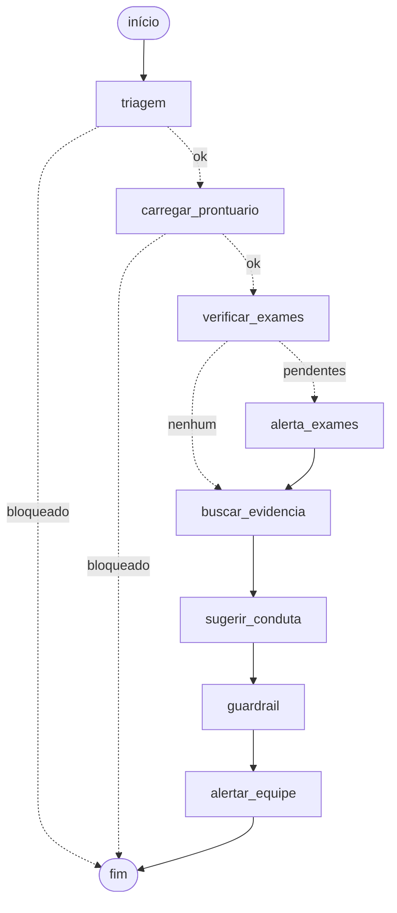

# Relatório Técnico — Assistente Médico com LLM Fine-tunada

**Tech Challenge — Fase 3**

> Sistema acadêmico de apoio à decisão clínica. Não substitui julgamento
> médico e não emite prescrições sem validação humana.

---

## 1. Requisitos e onde foram atendidos

| Requisito do enunciado | Implementação | Seção |
|---|---|---|
| Fine-tuning de um modelo LLM | QLoRA sobre `Qwen2.5-1.5B-Instruct` | 4 |
| Preprocessing, anonimização e curadoria | `src/preprocessing/` | 3 |
| Pipeline LangChain com a LLM customizada | `src/app/chain.py` | 6 |
| Consultas a base estruturada | SQLite com prontuários sintéticos | 6 |
| Contextualização com dados do paciente | Prontuário injetado no prompt | 6 |
| Limites de atuação, sem prescrição direta | Guardrails programáticos | 8 |
| Logging para rastreamento e auditoria | Trilha JSONL com `trace_id` | 8 |
| Explainability das respostas | PMID citado e verificado | 8 |
| Fluxos de decisão automatizados | LangGraph com desvios condicionais | 7 |
| Projeto modularizado em Python | Estrutura em `src/` | 6 |
| Avaliação e análise dos resultados | Dois experimentos comparados | 5 |

---

## 2. Arquitetura

O sistema responde perguntas clínicas combinando três fontes: uma LLM
submetida a fine-tuning, que define o formato e o registro da resposta; uma
base de artigos científicos consultada a cada pergunta, que fornece o
conteúdo factual e a fonte citável; e o prontuário do paciente, que ancora a
resposta no caso concreto.

O uso simultâneo de fine-tuning e recuperação de evidência é deliberado. O
fine-tuning ensina comportamento, mas é inadequado para armazenar fatos:
conhecimento embutido nos pesos não tem fonte para citar e envelhece com o
modelo. A recuperação entrega fatos verificáveis e atualizáveis — indexar um
protocolo novo leva segundos, retreinar levaria horas. Uma solução baseada
apenas em fine-tuning produziria respostas fluentes e sem fonte, o pior
resultado possível em contexto médico.

O modelo base é o `Qwen/Qwen2.5-1.5B-Instruct`. A escolha decorre da
necessidade de treinar numa GPU T4 de 16 GB, recurso gratuito do Google
Colab; LLaMA-8B ou Falcon-7B exigiriam hardware fora do alcance do projeto.
O enunciado permite a substituição ao mencionar "LLaMA, Falcon ou um outro".

A orquestração emprega LangChain no pipeline de pergunta e resposta e
LangGraph no fluxo de decisão.

---

## 3. Dados

### Dataset

Foi utilizado o **PubMedQA** (PQA-L): mil perguntas clínicas extraídas de
artigos científicos, com contexto do artigo, rótulo `yes`/`no`/`maybe`,
conclusão em texto e PMID. Foi preferido ao MedQuAD por trazer o contexto
científico junto da resposta, o que permite treinar o modelo a fundamentar a
conclusão em vez de apenas reproduzi-la, e por oferecer o identificador que
viabiliza a explainability.

### Pipeline de preparação

Cinco etapas em sequência: normalização Unicode NFKC com remoção de
caracteres de controle; anonimização; curadoria por tamanho e validade do
rótulo; deduplicação por SHA-256; e divisão estratificada com seed fixa.

A **anonimização** substitui dados pessoais por marcadores tipados
(`Dr. Silva` para `[NAME]`, `12/03/2019` para `[DATE]`), preservando a
semântica do texto. São cobertos e-mail, URL, CPF, CNS, telefone, número de
prontuário, datas completas, nomes precedidos de título clínico e idade
igual ou superior a 90 anos, esta considerada identificador indireto sob a
HIPAA. Embora o PubMedQA seja composto por abstracts já despersonalizados, a
etapa é necessária porque o pipeline foi construído para receber os
documentos internos do hospital previstos no enunciado.

A **deduplicação** previne vazamento de dados: o mesmo exemplo em treino e
teste produziria acerto por memorização, inflando a avaliação.

### Resultados

| Métrica | Valor |
|---|---|
| Exemplos brutos / após curadoria | 1.000 / 1.000 |
| Distribuição dos rótulos | yes 552 / no 338 / maybe 110 |
| Dados pessoais substituídos | 10 datas, 1 URL |
| Média de caracteres do contexto | 1.379 |
| Divisão final | 799 treino / 99 validação / 102 teste |

O dado mais relevante é o desequilíbrio: 55% de `yes` e apenas 11% de
`maybe`. Ele determina a métrica adotada na avaliação e origina o principal
problema enfrentado pelo projeto.

---

## 4. Fine-tuning

### Técnica

Treinar os 1,5 bilhão de parâmetros exigiria dezenas de gigabytes de VRAM,
contra os quinze disponíveis. O QLoRA combina quantização — pesos do modelo
base regravados em 4 bits e congelados — com LoRA, que acrescenta matrizes
de baixo posto treináveis ao lado das camadas existentes.

Foram treinados **18.464.768 parâmetros de 1.562.179.072 (1,18%)**, gerando
um artefato de cerca de 70 MB.

### Configuração

| Parâmetro | Valor | Justificativa |
|---|---|---|
| LoRA r / alpha | 16 / 32 | Equilíbrio entre capacidade e memorização |
| Módulos alvo | atenção + MLP | Restringir à atenção reduziria o ganho |
| Batch efetivo | 16 (2 × 8 acumulação) | Efeito de batch grande, memória de batch pequeno |
| Learning rate | 2e-4, cosine | Padrão para LoRA |
| Otimizador | paged_adamw_8bit | Evita estouro de memória |
| Gradient checkpointing | ativo | ~30% mais lento, mas cabe na GPU |

Merece destaque a opção `assistant_only_loss`: com ela, o modelo é corrigido
apenas pelos erros cometidos na resposta, não no enunciado. Sem ela, parte
do treino seria gasta aprendendo a reproduzir o abstract de entrada, texto
que o modelo nunca precisa gerar. Nenhum erro seria emitido — o resultado
seria apenas silenciosamente pior.

### Execução

GPU T4 do Colab. O primeiro experimento levou 1h59, em 150 passos de ~46
segundos. A lentidão decorre da reversão da quantização a cada operação, do
recálculo imposto pelo gradient checkpointing e da ausência de suporte a
bfloat16 na T4.

---

## 5. Avaliação e análise

### Metodologia

O modelo base e o treinado foram comparados sobre os mesmos 102 exemplos de
teste, não vistos no treino, com geração determinística. A comparação com o
base é o que permite atribuir o ganho ao trabalho realizado, e não ao Qwen.

A métrica principal é o **F1 macro**. Um modelo que respondesse `yes`
indiscriminadamente acertaria 54,9% dos casos — percentual aparentemente
razoável —, mas obteria F1 macro de cerca de 0,24, pois a métrica avalia as
três classes separadamente e tira a média simples. Foram reportados também
acurácia, F1 por classe, ROUGE-L da justificativa e taxa de respostas sem
veredito extraível.

### Experimento 1

Três épocas, prompt de sistema em português, sem tratamento do
desequilíbrio.

| Época | Erro na validação |
|---|---|
| 1 | **1,580** (melhor) |
| 2 | 1,604 |
| 3 | 1,632 |

O erro de treino caiu de 1,79 para 1,23 enquanto o de validação subiu desde
a primeira época: **overfitting**. Com 799 exemplos e 18 milhões de
parâmetros ajustáveis, há capacidade de sobra para memorizar. A configuração
preservava o melhor checkpoint, e não o último.

| Métrica | Base | Fine-tuned |
|---|---|---|
| Acurácia | 0,5686 | 0,5980 |
| **F1 macro** | 0,2912 | **0,3397** |
| F1 (yes) | 0,7237 | 0,7333 |
| F1 (no) | 0,1500 | 0,2857 |
| F1 (maybe) | 0,0000 | 0,0000 |
| ROUGE-L | 0,0425 | 0,0464 |

Dois problemas foram identificados.

**Viés para a classe majoritária.** Das 102 respostas, 94 foram `yes`, sete
`no` e uma `maybe`. Dos onze casos efetivamente `maybe`, os onze foram
errados. O modelo adotou a estratégia que minimiza a punição: responder
sempre a classe mais frequente. É racional do ponto de vista matemático e
inútil do ponto de vista clínico, já que `maybe` representa evidência
inconclusiva.

**ROUGE-L inválido.** O prompt estava em português e as respostas de
referência em inglês. O modelo obedecia ao idioma da instrução, e a métrica
media diferença de idioma, não qualidade da justificativa.

### Correções

Prompt de sistema reescrito em inglês; treino reduzido a uma época; e
classes igualadas no treino (266 exemplos cada, por undersampling de `yes` e
oversampling de `maybe`).

O balanceamento tem custo: menos variedade de `yes` e repetição dos exemplos
de `maybe`, o que amplia o risco de memorização. Em contrapartida, elimina a
vantagem de ignorar as classes raras. Apenas o treino foi balanceado —
validação e teste preservam a distribuição real, pois avaliar num conjunto
equilibrado mediria o modelo num cenário inexistente.

### Experimento 2

O treino levou 36 minutos e terminou com erro de validação de 1,639,
superior ao do primeiro experimento. O resultado é esperado: a validação
mantém 55% de `yes`, enquanto o modelo passou a esperar distribuição
equilibrada, e a métrica penaliza essa menor confiança. É evidência
adicional de que o erro de treino não deve ser o critério final de escolha.

### Erro de medição identificado

A primeira avaliação do experimento 2 devolveu métricas **idênticas** para
base e fine-tuned, até a quarta casa decimal. A causa foi a chamada de
`merge_and_unload()`, que funde os pesos do adaptador ao modelo base: como o
base está quantizado em 4 bits e os ajustes do LoRA são pequenos, eles
desapareciam no arredondamento. A biblioteca `peft` emite aviso a respeito.

Removida a fusão, o F1 macro passou de 0,3835 para 0,4932. Durante duas
avaliações, portanto, um erro de medição ocultou integralmente o efeito do
treino. O resultado inválido foi preservado no arquivo de métricas sob a
chave `finetuned_com_merge_invalido`.

### Resultados finais

| Métrica | Base | Fine-tuned | Variação |
|---|---|---|---|
| Acurácia | 0,6275 | 0,5784 | -7,8% |
| **F1 macro** | 0,3835 | **0,4932** | **+28,6%** |
| F1 (yes) | 0,7660 | 0,6947 | -9,3% |
| F1 (no) | 0,3846 | 0,5974 | +55,3% |
| F1 (maybe) | 0,0000 | **0,1875** | saiu do zero |
| ROUGE-L | 0,1695 | 0,2795 | +64,9% |
| Respostas sem veredito | 0,0000 | 0,0000 | — |

```
real\previsto    maybe     no    yes
maybe                3      5      3
no                   9     23      3
yes                  9     14     33
```

As previsões passaram a se distribuir entre as três classes — 39 `yes`, 42
`no` e 21 `maybe` —, contra 94, 7 e 1 do experimento anterior.

### Análise

A trajetória do F1 macro foi 0,2912 (base, prompt pt) → 0,3397 (treino 1) →
0,3835 (base, prompt en) → 0,4932 (treino 2). O ganho de 69% decompõe-se em
duas contribuições:

| Intervenção | Ganho no F1 macro |
|---|---|
| Alinhamento do idioma do prompt ao dos dados | +0,0923, sem treino |
| Fine-tuning com balanceamento, uma época | +0,1097 |

A troca do idioma da instrução, alteração de poucos minutos e sem custo
computacional, produziu ganho superior ao do fine-tuning completo do
primeiro experimento.

A acurácia caiu enquanto o F1 macro subiu. Não há contradição: o modelo
deixou de explorar o desequilíbrio e passou a arriscar respostas nas três
classes, errando alguns `yes` que antes acertava por inércia. Uma seleção
baseada em acurácia teria resultado na escolha do modelo pior.

Há correção excessiva a registrar: o modelo final prevê `no` 42 vezes para
35 casos reais e `maybe` 21 vezes para 11. O balanceamento igualou as
classes em um terço cada, enquanto a distribuição real é 55/34/11. Um
balanceamento parcial, próximo de 45/35/20, tende a produzir resultado
melhor.

---

## 6. O assistente

### Componentes

O assistente reside em `src/app/`, apoiado na base de pacientes (`src/db/`)
e no banco de evidências (`src/rag/`). O módulo `llm.py` carrega o modelo
treinado no formato esperado pelo LangChain; `chain.py` monta a pergunta,
recupera o contexto e produz a resposta; `ui.py` provê a interface Streamlit.

### Base estruturada de pacientes

Como o PubMedQA fornece evidência científica e não prontuários, foi criada
uma base SQLite com **20 pacientes sintéticos** contendo diagnóstico, setor,
exames com status pendente ou concluído, medicações e alergias. O enunciado
autoriza a abordagem ao aceitar "dataset anonimizado ou exemplo de dados
sintéticos".

Os dados são fictícios mas clinicamente coerentes: cada diagnóstico vem com
os exames pertinentes. Isso é relevante porque o fluxo de decisão opera
sobre eles — um exame pendente altera o caminho percorrido. Os pacientes são
identificados apenas por iniciais, e a geração é determinística.

### Compatibilidade entre prompt e formato de treino

A primeira versão usava prompt de formato livre, com instrução para citar as
fontes. O modelo desconsiderou a instrução, citando o PMID em apenas uma de
três respostas de teste. A causa era o descompasso com o formato de treino
(`Verdict:` seguido de `Rationale:`). Após replicar essa estrutura no prompt
de inferência, a citação passou a ocorrer de forma consistente.

Um ajuste menor seguiu a mesma lógica: a evidência era apresentada numerada
(`[1] PMID 12836106`), e o modelo citava o índice da lista em vez do artigo.
Removida a numeração, a citação passou a apontar para o PMID.

---

## 7. Fluxo de decisão automatizado

O pipeline do LangChain é linear, mas o enunciado determina que o sistema
possa "acionar diferentes etapas, como verificar exames pendentes, sugerir
tratamentos e emitir alertas para a equipe médica". Isso exige decisão, não
sequência. O atendimento foi modelado como máquina de estados com LangGraph.



O diagrama é gerado a partir do grafo compilado, e não desenhado
manualmente, eliminando divergência entre documentação e implementação.

### Pontos de decisão

Perguntas bloqueadas encerram o fluxo na **triagem**, sem que o modelo seja
carregado — além da economia de recurso, há redução da superfície de risco.
**Paciente inexistente** também encerra cedo, evitando resposta
descontextualizada. Havendo **exames pendentes**, o fluxo percorre um nó que
emite alerta antes de prosseguir.

O comportamento foi verificado: o paciente PAC-0009, com uma urocultura
pendente, percorre os oito nós; o PAC-0004, sem pendências, não passa pelo
nó de alerta.

### Alertas

| Nível | Condição |
|---|---|
| crítico | A resposta menciona substância à qual o paciente é alérgico |
| crítico | O modelo tentou prescrever e a posologia foi removida |
| atenção | Há exames pendentes, ou a resposta não cita fonte |
| informativo | Validação humana pendente, em toda resposta |

O alerta de alergia só é possível cruzando a saída do modelo com a base
estruturada; nenhuma instrução em prompt garantiria essa verificação.

---

## 8. Segurança, auditoria e explainability

### Por que o prompt não constitui controle

O prompt determina que o modelo cite fontes e declare quando a evidência é
insuficiente. Nos testes, houve citação em uma resposta de cada três, e
nenhuma declaração de insuficiência — inclusive quando o modelo respondeu
sobre pneumonia nosocomial a uma pergunta sobre pneumonia adquirida na
comunidade. Isso sem qualquer tentativa adversarial.

Instruções em prompt são comprometidas por três fatores: solicitação
explícita para ignorá-las, alucinação e a deriva provocada pelo próprio
fine-tuning, que treinou formato e conteúdo, não segurança. Por essa razão,
a validação é executada em código, fora do modelo.

### Entrada

Dados pessoais são removidos, reaproveitando o anonimizador escrito para
preparar o dataset. Tentativas de sobrescrever as instruções do sistema e
assuntos fora do domínio clínico interrompem o fluxo. Pedidos de dose são
marcados mas não bloqueados: a pergunta pode ser legítima, e o controle
permanece na saída, onde reside o risco.

### Saída

Doses e posologias são substituídas por marcador que indica o motivo.
Linguagem prescritiva vira alerta crítico. A ausência de PMID, havendo
evidência disponível, é sinalizada. Todo texto recebe o aviso de validação
obrigatória.

É assim que o requisito de "nunca prescrever diretamente, sem validação
humana" deixa de ser intenção declarada e passa a ser comportamento
garantido.

### Auditoria

Cada atendimento recebe identificador único, e cada passo grava uma linha
JSON em log incremental. Uma execução completa registra quinze eventos:
entrada, prontuário consultado, PMIDs recuperados, geração, guardrail,
alertas e passagem por cada nó. O identificador é o que permite reconstruir,
posteriormente, qual evidência sustentou qual recomendação para qual
paciente.

### Explainability

Três camadas: os PMIDs utilizados são retornados com link para o PubMed; o
guardrail verifica se a citação de fato ocorreu, em vez de confiar na
obediência do modelo; e o estado final traz a lista dos nós percorridos.

---

## 9. Limitações

**Dataset externo.** O enunciado pressupõe protocolos internos; foi utilizado
um conjunto público como aproximação. O pipeline de anonimização foi
construído para documentos internos, mas não exercitado com eles.

**Prontuários sintéticos**, com variabilidade inferior à realidade.

**Modelo pequeno.** O F1 macro de 0,49 é modesto. Observou-se o modelo
resumindo o documento recuperado em vez de responder à pergunta formulada.

**Cobertura da base.** O PubMedQA contém poucos artigos sobre diversos temas
testados, e a busca retorna sempre os três documentos mais próximos, ainda
que nenhum seja relevante. O sistema não informa que não dispõe da
informação.

**Truncamento na busca.** O modelo de embeddings processa cerca de 256
tokens, e os documentos são maiores; detalhes na seção de resultados não
influenciam a recuperação.

**Avaliação restrita.** São 102 exemplos, sem avaliação por especialista e
sem medição de alucinação.

**Duas variáveis alteradas simultaneamente** no experimento 2. A avaliação
do base sob os dois prompts isola parcialmente o efeito do idioma, mas não
completamente.

**Guardrails por expressões regulares.** Cobrem as formas usuais de dose e
posologia, mas padrões são enumeráveis e formulações incomuns podem escapar.
A validação humana obrigatória mitiga o risco.

**Idioma inconsistente.** O modelo responde em inglês; a interface está em
português.

**Sem controle de acesso.** Inexistem autenticação e perfis de usuário.

Próximos passos: balanceamento parcial das classes, avaliação por
especialista, modelo verificador da saída, indexação de protocolos internos e
autenticação com perfis.

---

## 10. Conclusão

O projeto atende às quatro entregas técnicas exigidas: fine-tuning com dados
médicos, assistente com LangChain integrando base estruturada e evidência,
segurança com guardrails e auditoria, e código modularizado.

O resultado quantitativo é modesto em termos absolutos. O que o trabalho
produziu de mais relevante foram três achados que só se tornaram visíveis
pela condução de dois experimentos controlados: o alinhamento do idioma do
prompt superou, em efeito, duas horas de fine-tuning; o balanceamento das
classes elevou o F1 macro em 28,6% ao custo da acurácia, evidenciando por
que essa métrica é inadequada em dados desbalanceados; e a fusão de
adaptadores LoRA em modelos quantizados em 4 bits pode anular silenciosamente
o treino, invalidando a avaliação.
